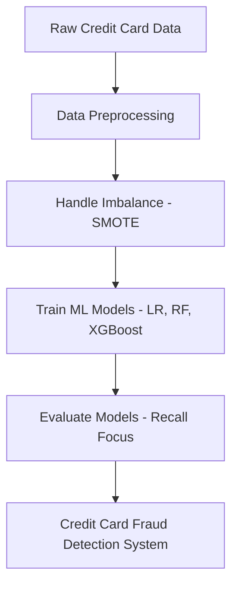

----------------------------------------------------------------------
GENERATED README FOR FRAUD DETECTION PROJECT:
----------------------------------------------------------------------
# Credit Card Fraud Detection System

## Overview

This project implements a Credit Card Fraud Detection System, focusing on binary classification for highly imbalanced datasets. It leverages techniques like SMOTE to address data imbalance and compares the performance of various machine learning algorithms (Logistic Regression, Random Forest, XGBoost) with a strong emphasis on optimizing recall. Designed for reproducibility and ease of demonstration, it serves as a practical example of tackling real-world data science challenges.

## Key Features

*   **Supervised Machine Learning:** Develops a robust system for binary classification of fraudulent transactions.
*   **Imbalanced Data Handling:** Specifically addresses highly imbalanced datasets (0.172% fraud rate) using techniques like SMOTE (Synthetic Minority Over-sampling Technique).
*   **Algorithm Comparison:** Evaluates and compares the performance of multiple classification algorithms, including Logistic Regression, Random Forest, and XGBoost.
*   **Recall Optimization:** Prioritizes and optimizes for recall, a critical metric for minimizing false negatives in fraud detection.
*   **Interactive Development:** All core logic is implemented within a Jupyter Notebook for step-by-step analysis and visualization.
*   **Reproducible Environment:** Utilizes `requirements.txt` and `apt.txt` for consistent dependency management and offers one-click execution via MyBinder.

## Technologies Used

*   **Primary Programming Language:** Python
*   **Machine Learning:**
    *   `scikit-learn`: Core ML functionalities, model training, and evaluation.
    *   `imbalanced-learn`: Specialized library for handling imbalanced datasets (e.g., SMOTE).
    *   `xgboost`: High-performance gradient boosting framework.
*   **Data Manipulation & Analysis:**
    *   `numpy`: Numerical computing.
    *   `pandas`: Data structures and analysis.
*   **Visualization:**
    *   `matplotlib`: Plotting library.
    *   `seaborn`: Statistical data visualization.
*   **Interactive Development Environment:**
    *   `Jupyter Notebook` (`jupyter`, `ipykernel`)
*   **Reproducibility & Deployment:**
    *   `MyBinder`: For cloud-based, interactive execution.
*   **Version Control:**
    *   `Git`: Standard version control.
    *   `git-lfs`: Git Large File Storage (suggested for potential large datasets/models).

## Project Structure

*   `fraud-detection-demo-a3.ipynb`: The central Jupyter Notebook containing the entire project workflow, from data loading and preprocessing to model training, evaluation, and visualization.
*   `requirements.txt`: Lists all Python package dependencies required to run the project, ensuring environment consistency.
*   `apt.txt`: Specifies system-level dependencies (e.g., `git-lfs`) that might be needed for specific execution environments like MyBinder.
*   `README.md`: This file, providing a comprehensive overview, features, and instructions for the project.
*   `.gitignore`: Configures files and directories that Git should ignore (e.g., virtual environments, build artifacts, Jupyter checkpoints).

## Installation/Setup

To set up and run this project locally, follow these steps:

1.  **Clone the Repository:**
    ```bash
    git clone <repository_url>
    cd <repository_name>
    ```
    *(Replace `<repository_url>` and `<repository_name>` with the actual details.)*

2.  **Install Git LFS (Optional, but Recommended):**
    If the project uses large data files tracked by Git LFS, you'll need to install it.
    ```bash
    git lfs install
    git lfs pull
    ```
    *(Refer to `apt.txt` for system-level dependency hints, e.g., `sudo apt-get install git-lfs` on Debian/Ubuntu.)*

3.  **Create a Virtual Environment:**
    It's highly recommended to use a virtual environment to manage dependencies.
    ```bash
    python -m venv venv
    ```

4.  **Activate the Virtual Environment:**
    *   **On macOS/Linux:**
        ```bash
        source venv/bin/activate
        ```
    *   **On Windows:**
        ```bash
        .\venv\Scripts\activate
        ```

5.  **Install Python Dependencies:**
    Install all required Python packages using `pip`.
    ```bash
    pip install -r requirements.txt
    ```

## Usage

### Running the Jupyter Notebook Locally

1.  **Activate your virtual environment** (if not already active).
2.  **Start Jupyter Notebook:**
    ```bash
    jupyter notebook
    ```
3.  Your web browser will open, displaying the Jupyter dashboard. Navigate to and open `fraud-detection-demo-a3.ipynb`.
4.  You can then execute the cells sequentially to run the fraud detection system, observe the data analysis, model training, and evaluation results.

### Running via MyBinder (Recommended for Quick Access)

This project is configured for one-click execution on MyBinder, providing a fully set-up environment in your browser.

*   Click on the Binder badge (if provided in the original `README.md`) or navigate to the project's Binder link. This will launch a live, interactive Jupyter environment directly in your web browser, pre-loaded with all dependencies and the notebook ready to run.

##  Generated Mind Map:


## Interactive Q&A (demonstrating conversation memory)

### Q: What machine learning algorithms are used in this project?

[Prompt 4: Answering with conversation memory...]
A: Based on the provided analysis and documentation, the project uses the following machine learning algorithms:

1.  **Logistic Regression**
2.  **Random Forest**
3.  **XGBoost**

**Evidence from the analysis:**
The "Analysis" section states: "...comparing the performance of multiple classification algorithms (Logistic Regression, Random Forest, XGBoost)..."

**Evidence from the documentation:**
The "Documentation" section under "Overview" states: "...compares the performance of various machine le...

### Q: How is class imbalance handled?

[Prompt 4: Answering with conversation memory...]
A: Based on the provided analysis, class imbalance is handled primarily through the use of **SMOTE** (Synthetic Minority Over-sampling Technique).

Here's the specific evidence:

1.  **Analysis - Project type and purpose:**
    *   "The project focuses on addressing the challenge of **highly imbalanced datasets** (0.172% fraud rate) by employing techniques like **SMOTE**..."

2.  **Documentation - Overview:**
    *   "This project implements a Credit Card Fraud Detection System, focusing on binary ...