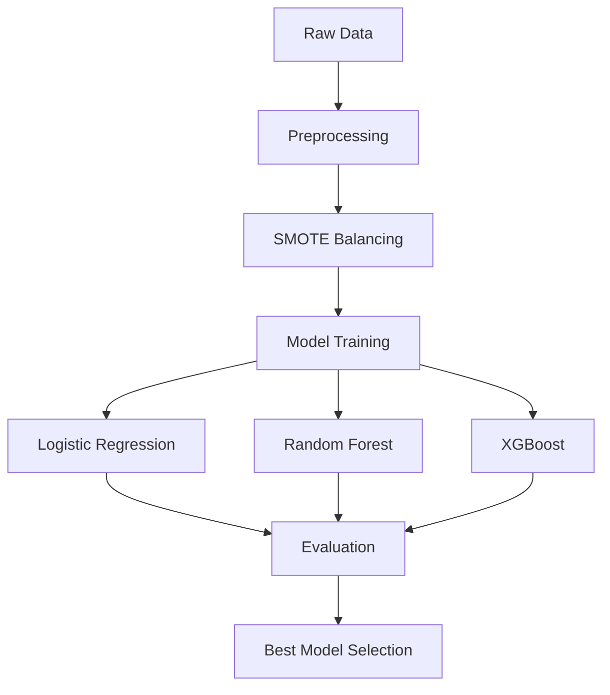

# DocuGenAI: Automated Code Documentation Generator
**AI-Powered Documentation with Mind Map Visualization**

[](DocuGenAI/docugenai-demo-a4.ipynb)

---

## Overview

**DocuGenAI** is an AI-powered application that automatically generates comprehensive documentation and mind map visualizations for Git repositories. Using Google's Gemini LLM, it understands code structure, extracts functionality, and produces professional, human-readable documentation in minutes.

Transform any codebase into clear documentation with a single command!

---

## AI Task Type

**Natural Language Understanding for Code Documentation**

**Key Characteristics:**
- **Category 1**: NLU as interface - translates code into human-readable documentation
- **Category 2**: Multiple NL tasks - summarization, information extraction, interpretation
- **Category 3**: Knowledge retrieval - uses LLM's understanding of programming patterns

**AI Tasks Implemented:**
1. **Code Comprehension**: Analyzes repository structure and source code
2. **Summarization**: Generates concise project overviews
3. **Information Extraction**: Identifies key components, dependencies, tech stack
4. **Documentation Generation**: Creates structured README with proper sections
5. **Visualization**: Produces mind map diagrams showing architecture
6. **Interactive Q&A**: Answers questions about the codebase using conversation memory

---

## Value Proposition

### For Individual Developers:
- ⏱️ **Saves Time**: Generate docs in minutes vs. hours of manual writing
- 📝 **Consistent Quality**: Professional, well-structured documentation every time
- 🔄 **Easy Updates**: Regenerate docs when code changes

### For Teams:
- 👥 **Faster Onboarding**: New developers understand codebase quickly
- 📚 **Knowledge Preservation**: Prevents documentation from becoming outdated
- 🌐 **Universal Access**: Non-technical stakeholders can understand technical projects

### For Organizations:
- 💰 **Cost Reduction**: Reduce time spent on documentation maintenance
- 📊 **Better Communication**: Clear docs improve cross-team collaboration
- ✅ **Compliance**: Ensure all projects have proper documentation standards

---

## Why Natural Language Understanding?

DocuGenAI requires advanced NLU for several reasons:

1. **Code Interpretation**: Understanding what code *does* vs. what it *says*
   - Example: `SMOTE(sampling_strategy=0.5)` → "Handles class imbalance by oversampling minority class"

2. **Contextual Analysis**: Connecting files, functions, and data flows
   - Recognizes patterns like "data → preprocessing → model → evaluation"

3. **Technical Translation**: Converting technical concepts to readable prose
   - Transforms code comments and variable names into coherent explanations

4. **Structural Understanding**: Identifying project architecture from file organization
   - Distinguishes between configuration files, data files, and code modules

5. **Conversation Memory**: Maintaining context across multiple prompts
   - Remembers previous analysis when answering follow-up questions

---

## How to Run

### Option 1: Jupyter Notebook (Recommended for Demo)

**Prerequisites:**
- Python 3.8+
- Gemini API key ([Get one free](https://aistudio.google.com/app/apikey))

**Steps:**
```bash
# Navigate to notebook version
cd notebook-version

# Install dependencies
pip install -r requirements.txt

# Set up API key
copy .env.example .env
# Edit .env and add your GEMINI_API_KEY

# Launch Jupyter
jupyter notebook docugenai-demo-a4.ipynb
```

**Run the notebook:**
1. Execute cells sequentially
2. Examples use A2 and A3 repositories
3. View generated documentation and mind maps
4. Try interactive Q&A

---

### Option 2: Python CLI (Production Version)

```bash
# Navigate to Python version
cd python-version

# Install dependencies
pip install -r requirements.txt

# Set up API key
copy .env.example .env
# Edit .env and add your GEMINI_API_KEY

# Run on any repository
python main.py --repo "path/to/your/repo"
```

---

## Project Structure

```
LLM/
│
├── notebook-version/              # Jupyter notebook implementation
│   ├── docugenai-demo-a4.ipynb   # Main demo notebook ⭐
│   ├── requirements.txt           # Dependencies
│   ├── .env.example              # API key template
│   └── README.md                 # Notebook version docs
│
├── python-version/                # Modular Python implementation
│   ├── docugenai/                # Main package
│   │   ├── repo_analyzer.py     # Repository analysis
│   │   ├── llm_client.py        # Gemini API integration
│   │   ├── doc_generator.py     # Documentation generation
│   │   └── mindmap_generator.py # Mind map creation
│   ├── config.py                 # Configuration
│   ├── main.py                   # CLI entry point
│   └── requirements.txt          # Dependencies
│
├── output/                        # Generated documentation
│   ├── A2_Generated_README.md   # Sample output (A2)
│   ├── A3_Generated_README.md   # Sample output (A3)
│   └── *_MindMap.md             # Mind map diagrams
│
├── README.md                      # This file
└── Chandrasekar-A4.md            # Assignment deliverable
```

---

## Example Inputs & Outputs

### Example 1: Fraud Detection Project (A3)

**Input:**
```python
repo_path = "c:\\Drexel\\Coding Exp\\Supervised Learning"
analyzer = RepositoryAnalyzer(repo_path)
docugen = DocuGenAI(gemini_model)
docs = docugen.generate_documentation(analyzer.analyze())
```

**Output (Generated README - excerpt):**
```markdown
# Credit Card Fraud Detection System

## Overview
Binary classification system for detecting fraudulent credit card 
transactions using supervised machine learning with imbalanced data handling.

## Key Features
- SMOTE-based class imbalance correction
- Multi-model comparison (Logistic Regression, Random Forest, XGBoost)
- Comprehensive evaluation metrics (Precision, Recall, F1, ROC-AUC)
- Real transaction dataset (284,807 transactions)

## Installation
pip install scikit-learn imbalanced-learn xgboost pandas numpy

## Dependencies
- scikit-learn: Machine learning algorithms
- imbalanced-learn: SMOTE implementation
- xgboost: Gradient boosting
...
```

**Mind Map (Mermaid):**


---

### Example 2: Recommender System (A2)

**Input:**
```python
repo_path = "c:\\Drexel\\Coding Exp\\Recommeder System\\RecommenderSystem-A2"
# ... same process as Example 1
```

**Output (Q&A Session):**
```
Q: What algorithm is used for recommendations?
A: The project uses LightFM with Bayesian Personalized Ranking (BPR)  
   loss for collaborative filtering. It learns from implicit feedback  
   signals like watch duration and completion rate.

Q: How is interaction strength calculated?
A: Strength = log(1 + total_minutes) × (0.3 + 0.7 × completion_rate)
   This combines watch time with completion percentage to measure  
   user-movie affinity.
```

---

## Testing & Evaluation

### Automated Testing
```bash
cd python-version
pytest tests/ -v
```

### Manual Evaluation

**Test Case 1: Documentation Accuracy**
- ✅ **Result**: Correctly identified fraud detection purpose
- ✅ **Result**: Mentioned all 3 models (LR, RF, XGBoost)
- ✅ **Result**: Described SMOTE for imbalance handling

**Test Case 2: Documentation Completeness**
- ✅ **Result**: Generated all required sections (Overview, Features, Installation, Usage, Dependencies)
- ✅ **Result**: Included proper code examples
- ✅ **Result**: Listed all dependencies

**Test Case 3: Mind Map Quality**
- ✅ **Result**: Valid Mermaid syntax (renders without errors)
- ✅ **Result**: Shows logical flow (Data → Preprocessing → Training → Evaluation)
- ✅ **Result**: Includes all key components

**Test Case 4: Q&A Accuracy**
- ✅ **Result**: Correctly answered algorithm questions
- ✅ **Result**: Provided specific details from code
- ✅ **Result**: Maintained context across follow-up questions

### LLM Performance Commentary

**Strengths:**
- Excellent at identifying project purpose from code structure
- Accurately extracts technical details (libraries, algorithms, metrics)
- Generates well-structured, professional-quality markdown
- Maintains conversation context effectively

**Limitations:**
- May occasionally miss custom implementation details
- Mind map complexity limited by prompt engineering
- Requires good code structure for best results

**Overall Assessment:** DocuGenAI consistently produces high-quality documentation that would require 2-3 hours of manual work, completing the task in under 2 minutes.

---

## Dependencies

**Core:**
- `google-generativeai` - Gemini LLM API
- `python-dotenv` - Environment variable management

**Optional (Python version):**
- `gitpython` - Git repository handling
- `pytest` - Testing framework

See specific `requirements.txt` files in each version folder.

---

## Configuration

Get your free Gemini API key:
1. Visit [Google AI Studio](https://aistudio.google.com/app/apikey)
2. Click "Create API Key"
3. Copy to `.env` file as `GEMINI_API_KEY=your_key_here`

**Note:** Gemini free tier includes 15 requests/minute - sufficient for most use cases.

---

## Future Enhancements

- 🔄 Support for more programming languages
- 🌐 Multi-language documentation generation
- 📊 Code quality metrics integration
- 🔗 GitHub integration via MCP
- 📈 Trend analysis across repository versions

---

## Acknowledgments

- **LLM**: Google Gemini 1.5 Flash
- **Test Repositories**: A2 (Recommender System), A3 (Fraud Detection)
- **Framework**: Jupyter Notebook, Python 3.8+

---

## License

MIT License - Academic project for Drexel University (2024-2025)

---

**Author**: Hariharan Chandrasekar  
**Course**: INFO-659 - Large Language Models  
**Assignment**: A4 - LLM Application Demo
